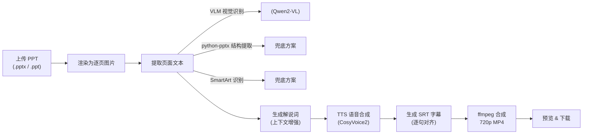
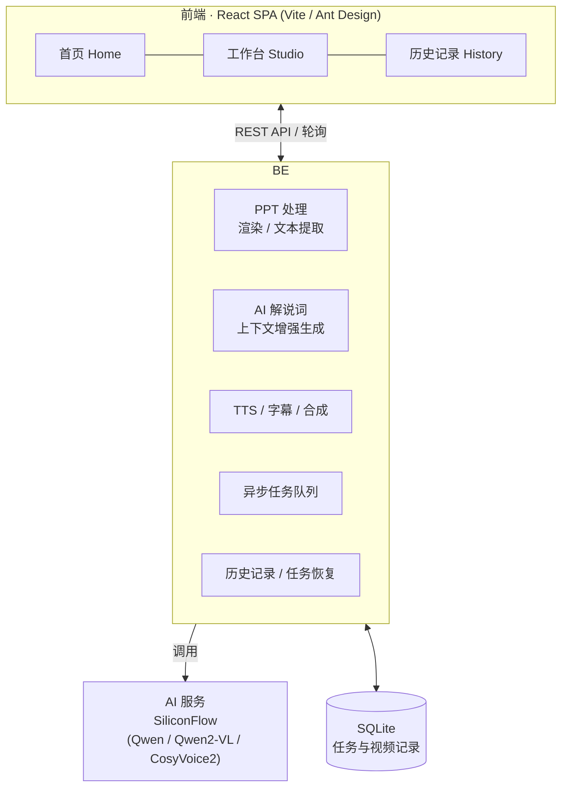
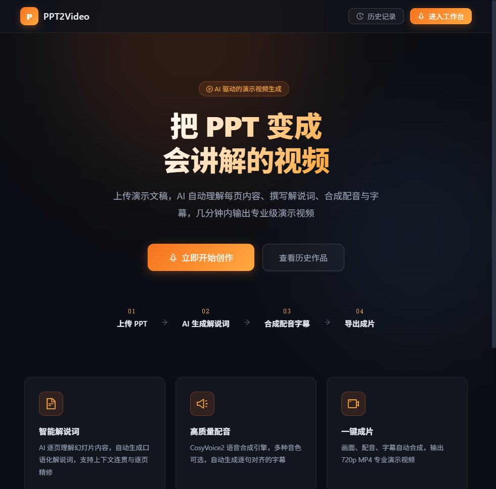
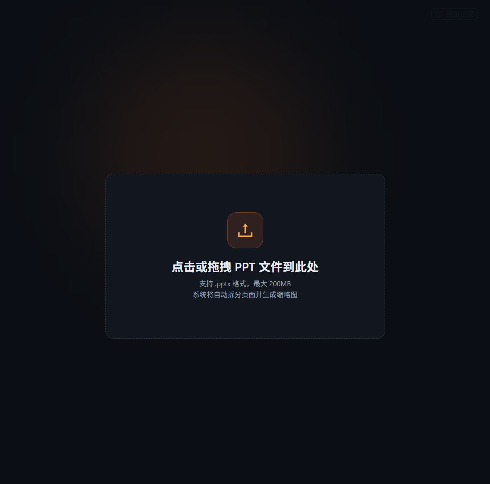
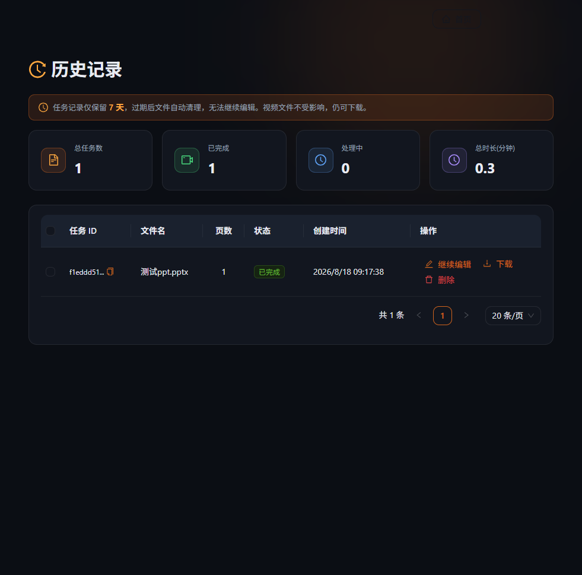

<p align="center">
  
</p>

<h1 align="center">🎬 PPT2Video</h1>

<p align="center">
  把静态的 PPT 变成带 AI 解说讲解、配音和字幕的演示视频
</p>

<p align="center">
  
  
  
  
  
  
</p>

<p align="center">
  英文 · <a href="#快速开始">快速开始</a> · <a href="#系统架构">系统架构</a> · <a href="#界面预览">界面预览</a> · <a href="#环境变量">环境变量</a> · <a href="#项目结构">项目结构</a> · <a href="#API-总览">API 总览</a> · <a href="#常见问题">常见问题</a>
</p>

---

**PPT2Video** 是一个开箱即用的 **PPT 转讲解视频**工具：上传 `.pptx` 演示文稿后，AI 会逐页理解幻灯片内容，自动撰写口语化解说词，再通过语音合成生成配音、逐句对齐的烧录字幕，最终合成一段 720p 的专业演示视频。全程无需剪辑，几分钟内即可产出成片。

---

## ✨ 核心特性

| 特性 | 说明 |
| --- | --- |
| 🧠 **智能解说词** | AI 逐页理解幻灯片内容，结合前后页上下文生成连贯、口语化的解说词，双击即可在页面上微调 |
| 🌐 **VLM 视觉识别** | 使用视觉大模型识别图片 / 图表中的文字，`VLM → python-pptx → SmartArt` 三级回退提取，结果更准确 |
| 🔊 **高质量配音** | 集成 CosyVoice2 语音合成，提供男声 / 女声多种音色，自动生成逐句对齐的字幕 |
| 🎞️ **一键成片** | 画面、配音、字幕自动合成，输出 720p MP4，支持开启 / 关闭字幕 |
| ⚡ **异步批量处理** | 大文件（>10 页）自动切换异步任务队列，实时进度可见，处理中即可预览已完成部分 |
| 🕹️ **继续编辑** | 任务中途中断或材料有需调整时，可从历史记录一键恢复并继续编辑 |
| 🖼️ **替换单页图片** | 某页渲染偏移时，可单独上传图片替换，不影响已生成的解说词和音频 |
| 🔒 **安全设计** | 接口限流、带会话鉴权的文件服务、上传路径与类型校验，防止路径穿越与恶意访问 |

## 🔄 工作流程



## 🏗️ 系统架构



**处理管线说明**：`PPT 上传 → 页面渲染 → 文本提取（三层回退）→ AI 解说词 → TTS 配音 → 字幕 → 视频合成`，全部在服务端完成，前端负责可视化编排和进度展示。

> 🔒 **隐私说明**：本项目为纯本地单用户运行，不依赖任何第三方身份体系，不上传用户标识或使用记录；AI 能力仅在使用时调用 SiliconFlow 云端 API（文本 / 视觉 / TTS）。

## 🚀 快速开始

### 环境要求

| 依赖 | 版本 / 说明 |
| --- | --- |
| Python | 3.10+ |
| Node.js | 18+（构建前端需要） |
| LibreOffice | 用于渲染 PPT / 兼容 `.ppt`（Windows 下亦支持 PowerShell 自动化渲染） |
| Poppler | `pdftocairo`（PDF 转图片，备用渲染链路） |
| FFmpeg | 音视频合成 |
| SiliconFlow API Key | 用于 AI 文本 / 视觉 / TTS 能力 |

> Windows 下启动器使用 **PowerPoint COM 自动化渲染**（更接近原稿）作为首选，LibreOffice 作为兜底；外部工具路径留空时自动检测。

### 方式一：一键启动（推荐）

1. 配置环境变量：

   ```bash
   # 复制配置模板并填写
   copy backend\.env.example backend\.env
   # 至少填写 SILICONFLOW_API_KEY
   ```

2. 安装后端依赖：

   ```bash
   pip install -r backend\requirements.txt
   ```

3. 安装前端依赖（可选，若已存在 `backend/static/frontend` 构建产物则后端直接托管静态页面）：

   ```bash
   cd frontend
   npm install
   cd ..
   ```

4. 启动：

   ```bash
   python start.py
   # 或 Windows 双击 start.bat
   ```

5. 打开浏览器访问 `http://localhost:9002`。

> `start.py` 会自动检测构建产物：存在则后端托管静态页面（单端口 9002），否则同时拉起 Vite 开发服务器（前端 5173）。

### 方式二：手动运行

后端（开发）：

```bash
cd backend
python main.py        # http://127.0.0.1:9002 · Swagger: /docs
```

前端（开发，需先 `npm install`）：

```bash
cd frontend
npm run dev           # http://localhost:5173
```

生产（后端托管构建产物）：

```bash
cd frontend && npm run build
# 构建产物会输出到 backend/static/frontend，之后仅需运行后端即可
cd ../backend && gunicorn -c gunicorn_conf.py main:app
```

### 方式三：Docker 部署

```bash
# 构建镜像（Dockerfile 已内置 LibreOffice / Poppler / FFmpeg 及前端构建）
docker build -t ppt2video .

# 运行
docker run -d --name ppt2video -p 9002:9002 \
  -e SILICONFLOW_API_KEY=sk-xxxx \
  -v $(pwd)/files:/app/files \
  -v $(pwd)/output_videos:/app/output_videos \
  ppt2video
```

## ⚙️ 环境变量

主要配置项（完整见 [`.env.example`](backend/.env.example)）：

| 变量 | 默认值 | 说明 |
| --- | --- | --- |
| `SILICONFLOW_API_KEY` | 空 | 必需，SiliconFlow API Key，多个用逗号分隔可自动轮询 |
| `TEXT_MODEL` | `Qwen/Qwen2.5-7B-Instruct` | 解说词生成的文本模型 |
| `VLM_MODEL` | `Qwen/Qwen2-VL-7B-Instruct` | 视觉大模型，识别图片 / 图表文字 |
| `TTS_MODEL` | `FunAudioLLM/CosyVoice2-0.5B` | 语音合成模型 |
| `TTS_MODE` | `api` | `api` / `chattts` / `local` |
| `PORT` | `9002` | 服务端口 |
| `FRONTEND_URL` | `http://localhost:5173` | 前端地址（用于 CORS） |
| `ASYNC_THRESHOLD_SLIDES` | `10` | 超过此页数则建议使用异步批量处理 |
| `VLM_CONCURRENCY` | `1` | VLM 并发数 |
| `FILE_RETENTION_DAYS` | `7` | 任务文件保留天数，过期自动清理（视频文件长期保留） |
| `JWT_SECRET` | 随机生成 | 生产环境务必设置强随机字符串 |

## 🖼️ 界面预览

<p align="center">
  
  
  <br/>
  
</p>

## 📁 项目结构

```
ppt2video-new
├── backend/                  # FastAPI 后端
│   ├── api/                  # 路由（ppt / history / restore）
│   ├── utils/                # 核心处理模块
│   │   ├── pptx_to_image*.py # PPT 渲染为图片
│   │   ├── vlm_text_extractor.py  # 视觉大模型提取文本
│   │   ├── enhanced_narration.py  # 上下文增强解说词生成
│   │   ├── audio_generate.py      # TTS 配音 + 字幕
│   │   ├── movie_editor.py        # ffmpeg 合成
│   │   └── task_queue.py          # 异步任务队列
│   ├── config.py             # 集中配置（读取 .env）
│   ├── main.py               # 应用入口
│   ├── requirements.txt
│   └── .env.example          # 环境变量模板
├── frontend/                 # React 前端
│   └── src/
│       ├── pages/            # Home / Studio / History
│       ├── stores/           # Zustand 状态
│       └── api/              # 接口封装
├── docs/                     # 文档图片资源
├── Dockerfile                # 多阶段构建（前端 + 后端）
├── nginx.conf                # 反向代理示例
├── start.py / start.bat      # 一键启动器
└── README.md
```

## 📡 API 总览

| 方法 | 路径 | 说明 |
| --- | --- | --- |
| `POST` | `/api/outline` | 上传 PPT，渲染页面并返回缩略图 |
| `POST` | `/api/generate-script` | 生成单页解说词 |
| `POST` | `/api/generate-script-list` | 同步批量生成解说词（≤10 页） |
| `POST` | `/api/async/generate-script-list` | 异步批量生成解说词（大文件） |
| `GET` | `/api/async/task/{id}` | 查询异步任务状态 / 进度 |
| `POST` | `/api/save-script` | 保存（编辑）解说词 |
| `POST` | `/api/generate-audio` | 生成配音（可指定单页或全部） |
| `POST` | `/api/generate-srt` | 生成字幕 |
| `POST` | `/api/generate-video` | 合成最终视频 |
| `POST` | `/api/replace-slide-image` | 替换单页图片 |
| `GET` | `/api/restore-job` | 恢复任务（继续编辑） |
| `GET` | `/api/history` / `/api/history/{id}` | 历史记录查询 / 删除 |
| `GET` | `/api/resources` | 获取页面资源（解说词 / 音频） |
| `GET` | `/api/voices` | 获取可用音色列表 |

完整交互式文档见部署后访问 `http://localhost:9002/docs`。

## 🧰 技术栈

- **后端**：Python 3.10 · FastAPI · SQLite · uvicorn / gunicorn · python-pptx · moviepy · pydub · pdf2image
- **前端**：React 18 · Vite · Ant Design 5 · Zustand · React Router · Axios
- **AI 能力**：SiliconFlow（Qwen / Qwen2-VL / CosyVoice2），可切换 TTS 接入方式
- **基础设施**：LibreOffice / PowerPoint 渲染 · Poppler · FFmpeg · Docker

## ❓ 常见问题

**Q：需要 GPU 吗？**
不需要。AI 文本 / 视觉 / TTS 均通过 SiliconFlow 云端 API 调用，本机只需 CPU 完成渲染与合成；本地 TTS（`TTS_MODE=local`）除外。

**Q：任务文件会保留多久？**
默认 7 天，过期自动清理且不可继续编辑；但已生成的视频文件不在清理范围，可永久下载。

**Q：PPT 页面的文字提取靠什么？**
三层回退：视觉大模型（VLM）识别图片与图表中的文字 → `python-pptx` 结构化提取 → SmartArt 识别，确保各类版式都能读到内容。

**Q：某页图片渲染错位怎么办？**
在工作台选中该页，点击「替换图片」上传新版图片即可，不影响已生成的解说词、音频和字幕。

## 📄 License

[MIT](LICENSE) © 2026 wanfengs66

---

<p align="center">
  如果这个项目对你有帮助，欢迎 <b>Star ⭐</b> 支持一下~
</p>